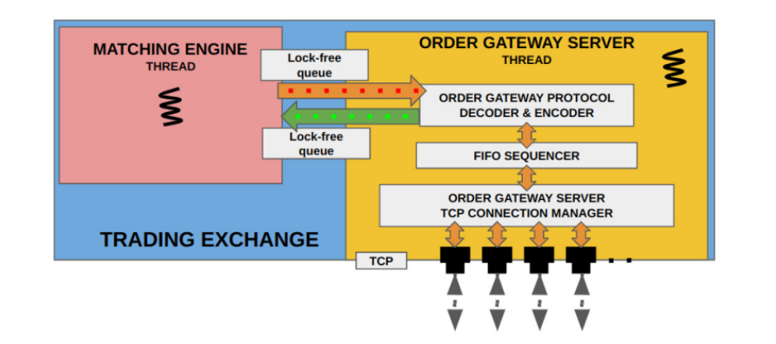

# Low_Latency_App_with_CPP

A modern C++ implementation of a full-pipeline, low-latency electronic trading ecosystem, following the architecture and design principles from Sourav Ghosh's *Building Low Latency Applications with C++* (Packt). The system is split into an **exchange side** (matching engine, order gateway, market data publisher) and a mirrored **client side** (order gateway client, market data consumer, trading strategy framework), communicating over TCP and UDP multicast.

## Architecture Overview

The diagram above shows the full trading ecosystem, exchange-side and client-side components together. Since the client-side components mirror their exchange-side counterparts in structure and communication pattern, individual client-side diagrams are omitted below for brevity — see the exchange-side breakdown for the equivalent design.

## Exchange-Side Components

### Trading Exchange (Matching Engine)

The core of the exchange: a `MatchingEngine` built on a `MEOrderBook` per instrument, using a circular doubly-linked price-level list for O(1) best-bid/ask access. Incoming client orders are sequenced through a `FIFOSequencer` to guarantee deterministic, fair matching order before being applied to the book.

### Market Data Publisher

Publishes book updates over two parallel UDP multicast streams — an **incremental stream** for real-time order book events, and a **snapshot stream** produced by a `SnapshotSynthesizer` that periodically rebuilds and broadcasts the full book state. Sequence numbers are stamped on every message so downstream consumers can detect gaps and resynchronize.

### Order Gateway Server

Handles client order flow over TCP: parses inbound receive buffers using `reinterpret_cast`-based binary framing, validates and forwards orders to the matching engine, and streams back execution reports and order acknowledgements to each connected client.

## Client-Side Components

Mirroring the exchange side, the client stack includes:

- **Market Data Consumer** — subscribes to both the incremental and snapshot UDP multicast streams, detects sequence-number gaps from packet loss, and recovers a consistent order book by resynchronizing against the latest snapshot.
- **Order Gateway Client** — manages the TCP connection to the exchange, sending orders and consuming execution/acknowledgement messages.
- **Feature Engine** — derives trading signals (e.g. fair value, VWAP, microprice) from the locally maintained order book.
- **Trading Strategy Framework** — consumes features and market/order updates to drive order placement logic.

## Repository Structure

| Folder | Description |
|---|---|
| `Exchange_with_Client` | Combined exchange-side and client-side source implementation |
| `Trading_Ecosystem_Design_Overview` | Architecture diagrams and design notes for the full trading ecosystem |
| `components_part1` | Early foundational components (data types, IPC, logging/time utilities) |

## Reference

Design and terminology follow Sourav Ghosh, *Building Low Latency Applications with C++* (Packt Publishing).