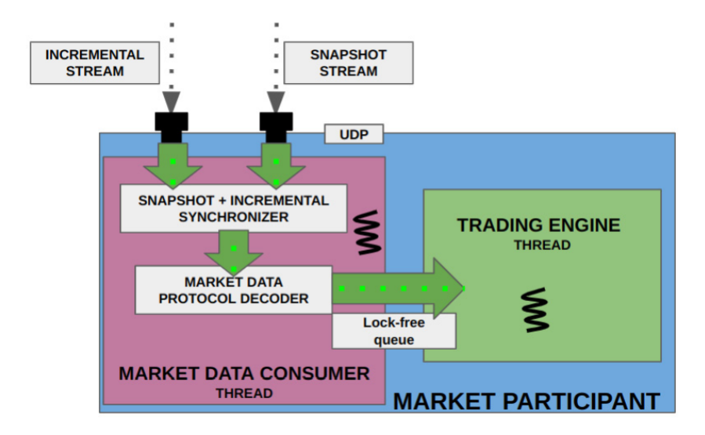
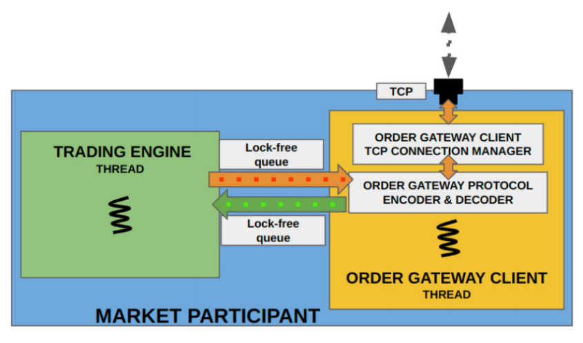
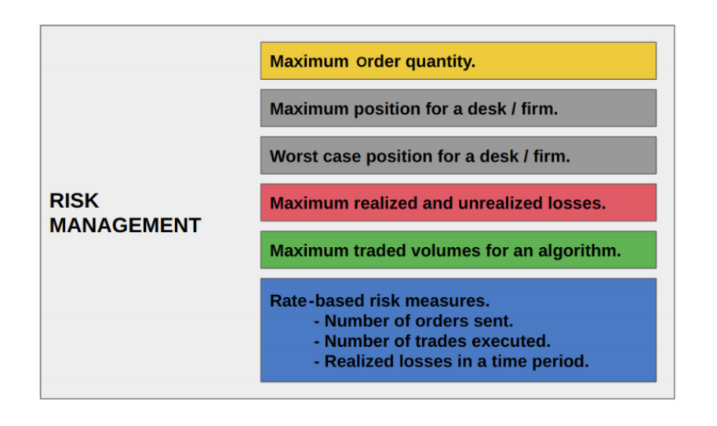
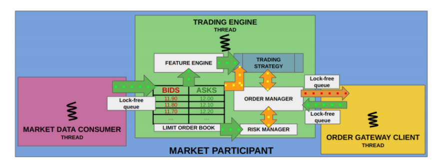

# Building the Market Participant's Interface to the Exchange

## Understanding the Market Data Consumer Infrastructure

The market data consumer component in a market participant's trading system corresponds directly to the market data publisher component on the exchange side. It is responsible for subscribing to and receiving the multicast network traffic published by the exchange, decoding and normalizing the market data read from the exchange protocol into an internal format, and implementing the synchronization mechanisms required to handle packet loss.

### Subscribing to and Receiving UDP Multicast Traffic

The first and most obvious task is subscribing to the multicast streams the exchange uses to publish market data. To achieve load balancing, exchanges typically distribute different trading instruments across different multicast stream addresses. This allows clients to selectively receive only the subset of data published by the exchange that corresponds to the instruments and products they care about. In practice, this involves the client joining the relevant multicast streams, whose addresses are typically published information made available by the exchange.

### Decoding and Normalizing Against the Exchange Protocol

The next task for the market data receiver is to convert the exchange's market data protocol into the internal format used by the other components of the participant's system.

Depending on the exchange market data protocol used, this component can vary considerably in complexity and processing latency. The fastest protocols to decode—such as EOBI and SBE—involve simple binary packed structures requiring minimal decoding effort, meaning the byte stream can essentially be reinterpreted directly as the expected binary structure for maximal decoding speed. By contrast, more complex protocols such as FAST generally take considerably longer to decode and normalize.

### Bootstrapping Synchronization and Handling Packet Loss

As discussed previously, exchanges generally prefer to distribute market data to participants over UDP. While UDP allows for faster transmission and higher throughput, its unreliable nature introduces the risk of packet loss and out-of-order delivery. To ensure market participants receive market data packets in the correct order and can detect packet loss, systems typically use packet-level and instrument-level sequence numbers that participants can validate against.

In addition, both the exchange's market data publisher and the participant's market data consumer need a mechanism to handle and recover from packet loss. The same mechanism is also needed when a participant connects to the data stream after the market has already opened, or needs to restart its market data consumer component for any reason. In all of these scenarios, the market data receiver on the client trading system needs to perform a synchronization operation in order to obtain a current and complete view of the limit order book.

Exchange market data feeds are generally split into two broad categories: snapshot streams and incremental streams.

### Incremental Market Data Streams

The incremental market data stream **assumes** that the market participant already holds a correct view of the limit order book as maintained by the matching engine; the stream only publishes updates relative to the book's previous state. This significantly reduces bandwidth requirements, since only the changes to the order book are transmitted. Under normal operating conditions, a market participant typically only needs to subscribe to the incremental stream in order to maintain a correct view of the order book.

If the client loses a packet from this stream, the order book state it maintains may diverge from the state held by the matching engine. The mechanism for handling such a failure is to clear or reset the participant's locally maintained order book. The participant then subscribes to the snapshot data stream—which contains the complete state of the order book rather than just incremental updates—in order to resynchronize to the correct order book state. The procedure is as follows: clear the local order book, begin buffering updates received from the incremental stream, wait for a complete order book snapshot to be built, and finally apply the buffered incremental updates on top of that complete order book to finish synchronizing.

### Snapshot Market Data Streams

The snapshot market data stream contains the data needed to build a complete order book starting from an entirely empty state. Typically, this stream contains nothing more than an exhaustive list of "Order Add" messages covering every passive order currently resting in the order book. Exchanges usually limit how often this list is updated and published, meaning the snapshot stream may only be sent once every few seconds. This is because the stream contains information on every order in every instrument's order book, which is a large amount of data and consumes considerable bandwidth. Furthermore, because packet loss is rare and participants starting up generally don't mind waiting a few seconds to obtain a correct view of the order book, this rate limiting typically has no significant negative impact.

### Snapshot and Incremental Stream Synchronizer

The market data consumer needs to include a subcomponent capable of subscribing to both the incremental and snapshot data streams. As discussed, whenever a participant's system starts up for the first time, restarts mid-session, or loses a packet from the incremental stream for any reason, its view of the limit order book is no longer accurate. In such cases, **the correct recovery or synchronization procedure** is to clear the current limit order book, subscribe to the snapshot stream, and wait to receive a complete order book snapshot. At the same time, updates continuing to arrive on the incremental market data stream need to be queued and buffered. Once a complete snapshot has been received, and all subsequent incremental updates (i.e., those with sequence numbers immediately following the last update in the snapshot) have also been queued, synchronization is complete. At this point, the system rebuilds the limit order book from the snapshot stream and applies all queued incremental updates on top of it, catching up to the exchange's data. The consumer can then stop receiving snapshot data and unsubscribe from that stream, switching to receiving only the incremental stream. The component in the market data consumer architecture responsible for carrying out this synchronization mechanism is known as the "snapshot and incremental stream synchronizer."

### Market Data Protocol Decoder

Another subcomponent is responsible for decoding data arriving on the snapshot and/or incremental market data streams. This component converts data from the exchange's native data format into the format used internally by the trading strategy framework. The converted data typically contains only a subset of the exchange's raw data fields, normalized across exchanges so that the trading strategy framework remains independent of exchange-specific details. For our market data consumer infrastructure, this component's design is relatively simple because we use a compact binary structure; in practice, however, as noted earlier, the data format can be considerably more complex (as with the FAST protocol).

## Understanding the Order Gateway Client Infrastructure

The order gateway client infrastructure in a market participant's trading system is a TCP client responsible for connecting to the exchange's order gateway server. Another of its tasks is to receive updates from the exchange over this TCP connection and decode messages conforming to the exchange's order message protocol into a standardized internal format for use by the rest of the system. Finally, the order gateway client component is also responsible for receiving order action requests issued by the trading framework, encoding them into the order message format recognized by the exchange, and sending them to the exchange.

It's worth keeping in mind that the order gateway client must always maintain a reliable TCP connection to the exchange. This ensures the exchange never misses any order request from the client, and the client never misses any order status update from the exchange. In addition to the reliability mechanisms inherent to the TCP protocol itself, exchanges and participants typically also implement application-layer reliability mechanisms. This usually involves strictly increasing sequence numbers on messages sent from the exchange to the client and from the client to the exchange. A heartbeat mechanism may also be used—where, during periods of low trading activity, the exchange sends specific messages to the client (or vice versa) to detect whether the connection is still alive.

There are also mechanisms used for authentication and identification when the client first connects, typically implemented through a handshake involving a user identifier and password, among other things. The system may also include other administrative messages (such as login authentication messages), depending on the interaction flow, and these can serve a wide range of purposes. (We won't go into detail on these administrative messages, as they are not relevant to the pursuit of low latency.)

The order gateway client within a market participant's trading system consists of two simple components.

### TCP Connection Manager

The order gateway client in a market participant's trading system is responsible for establishing and managing the connection to the exchange's order gateway server. In practice, due to load balancing, redundancy, and latency considerations, a single participant will typically establish multiple connections to the exchange. However, in the electronic trading ecosystem we will build, we adopt the design where **the order gateway client establishes only a single connection to the exchange's order gateway server**. We will use the TCP socket client library built in the previous chapter's "Socket-Based C++ Networking Programming" section.

### Order Gateway Protocol Codec

The order message format codec is responsible for converting order messages: it converts the internal format used by the trading strategy into the format required by the exchange, and converts **order responses** and execution notifications from the exchange into the internal format required by the strategy framework. The complexity of this component depends on the exchange's format requirements; in our trading system, however, we will use a compact binary structure to keep the codec logic simple.

#### On Order Responses and Execution Notifications

- **Order acknowledgment/rejection**

  New order accepted/acknowledged

  New order rejected — e.g., price out of limits, invalid quantity, failed risk checks, etc.

  Modify/cancel accepted or rejected

- **Execution (the most important category)**

  Fill/execution report — your order was partially or fully filled; this message reports the fill price and fill quantity.

  This is a different event from "your request was processed": submitting an order only places it into the order book, while the actual "event" is that someone traded against your order. This is pushed to you proactively by the exchange — it is not a direct response to a request you made.

- **Status changes**

  Order fully filled and removed from the order book (order done/filled)

  Order forcibly cancelled by the exchange for some reason (e.g., self-match prevention, circuit breaker, etc.) — this, too, is pushed proactively by the exchange, not in response to a request from you.

Next, we will conclude our discussion of the order gateway infrastructure and move on to the most complex (and most interesting) component in a participant's system — the trading strategy framework.

## Designing a Framework for Low-Latency C++ Trading Algorithms

Having discussed the market data receiver and order gateway client components of a market participant's trading system, the last component we need to discuss is the framework responsible for making trading decisions. This component is one of the most critical parts of the trading system, since it carries the system's "intelligence." Here, "**intelligence**" refers to a system that processes normalized market data updates, builds an understanding of market conditions, and computes trading analytics to discover trading opportunities and execute trades. This component naturally depends on the market data consumer to obtain decoded and normalized market data updates, and also makes use of the order gateway client to send order requests to, and receive order responses from, the exchange in decoded and normalized form.

### Building the Order Book

Market participants need to build a limit order book based on the market data published by the exchange. It's worth noting that a client does not necessarily need to build a complete order book, particularly when the trading strategy does not require such fine-grained data. A simple example is a strategy that only cares about the price and/or quantity of the most competitive orders (i.e., the highest bid and lowest offer, commonly referred to as the "top of book" [TOB] or "best bid and offer" [BBO]). Another example is a strategy that relies solely on trade prices to make decisions, without needing to see the full order book.

It's worth reiterating here that the order book built by the client differs slightly from the order book maintained by the exchange, because **the client generally cannot determine which market participant a given order belongs to**. In addition, depending on the exchange, certain information may not be visible to market participants — for instance, which orders are iceberg orders, which new orders are stop orders, and considerations related to self-match prevention mechanisms. Iceberg orders are orders whose hidden quantity exceeds the quantity shown in the public market data; stop orders are dormant orders that are only activated once a trade occurs at a specific price; self-match prevention (SMP) is a mechanism that prevents a client from trading against itself, which some exchanges choose to implement at the matching engine level. This book will ignore such special-purpose features and will not implement them. It should also be understood that the version of the order book held by a trading participant lags behind the order book held by the matching engine, since there is always some delay between the matching engine updating its order book and the trading client receiving the corresponding market update and updating its own order book.

### Building the Feature Engine

Sophisticated trading strategies need to build additional analytical intelligence beyond the order book data itself. These strategies need to implement a variety of trading signals and analytics based on the prices, liquidity, trade records, and order book data published by the exchange. The core idea is to build analytical capabilities that may include technical-analysis-style indicators, statistical predictive signals and models, and statistical edges related to market microstructure. While this book does not go deeply into the specifics of trading signals and predictive analytics (there are many dedicated books on the subject), it's worth noting that in practice, such predictive edge signals go by many names — trading signals, indicators, features, and so on. The component in a trading system responsible for building and integrating these predictive signals is commonly referred to as the feature/signal/indicator engine. This book will build a minimal feature engine for our trading strategy, though we reiterate that, depending on the complexity of the strategy, the feature engine's implementation can become quite sophisticated and complex.

### Developing the Execution Logic

After building the order book and deriving trading signals from the current market state, if the trading strategy identifies an opportunity, it still needs to execute orders on the exchange.

This is typically achieved by: **sending new orders; modifying existing orders (making them more or less aggressive in price); and/or cancelling existing orders (to avoid being filled).**

The subcomponent of the trading infrastructure responsible for sending, modifying, and cancelling orders — i.e., managing the strategy's orders on the exchange — is called the **execution system**. For the execution system, it is critical to be able to respond quickly to market data and order feedback from the exchange, and to send order requests as fast as possible. **The profitability and sustainability of a high-frequency trading system depends heavily on how low a latency the execution system can achieve.**

## Understanding the Risk Management System

The risk management system is a critical part of a trading strategy's infrastructure. From a technical standpoint, in a modern electronic trading ecosystem there are in fact multiple layers of risk management systems, distributed across the client's trading strategy framework, the order gateway client within the market participant's system, and the back-end systems of the clearing broker. This book focuses solely on implementing a minimal risk management system within the trading strategy framework. The risk management system aims to manage several different categories of risk, as illustrated below:

### Risk Based on Order Quantities

One metric many trading systems care about is the maximum quantity an algorithm is allowed to send for a single order. This is mainly intended to guard against software bugs or user error in the system, preventing an algorithm from accidentally sending an order far larger than intended. In practice, this kind of error is referred to as a "fat finger" error, meaning the user accidentally pressed extra keys due to a mistake.

### Risk Based on Firm Positions

One intuitive risk metric is the strategy's position in a given instrument. Position size directly determines how much money could be lost given a particular move in the market price. For this reason, a strategy's or firm's actual holdings ("realized position") in a given instrument is critical and closely monitored to ensure it remains within established limits. Note that "realized position" here refers to the position currently held by the strategy; this metric does not account for any other resting orders the strategy may have — orders which, if filled, could increase or decrease the position size.

Consider an example: suppose your current realized position is +100 (you've already bought and are holding 100 lots long). You also have two resting orders:

- A resting limit sell order for 50 lots, not yet filled
- A resting limit buy order for 30 lots, not yet filled

In this situation:

- **Realized position = +100** (counting only what has already traded and is currently held)
- If the 50-lot sell order suddenly gets filled, the position would become +50
- If the 30-lot buy order also gets filled, the position could become +130

Why does risk management focus only on "realized position" rather than including resting orders? Because:

- **A resting order is not guaranteed to fill** — it could sit there indefinitely, or it could be cancelled by you at any time, so it represents "potential risk" rather than "risk that definitely exists right now"
- **Realized position is the portion that is genuinely exposed to market moves right now** — if the market price suddenly drops, the immediate P&L impact comes from the 100 lots already held, not from the orders that haven't filled yet

That said, the fact that realized position does not account for resting orders also means it is a "lagging" or "incomplete" snapshot of risk — if your resting orders fill all at once, the position could jump suddenly and exceed limits. For this reason, many more sophisticated risk systems also calculate a "potential position" or "worst-case position" alongside realized position (i.e., what the position would become if all resting orders were assumed to fill), in order to guard against a sudden, unexpected blow-up in exposure.

**Long position**: you buy and hold, hoping to sell later at a higher price for a profit. For example, if you spend 10,000 to buy 100 lots of a contract, you now hold +100 lots — this is a long position. If the price rises, you make money; if it falls, you lose money.

**Short position**: this one is easy to confuse. Going short does not mean "selling something you already hold for cash" — it means **borrowing and selling something you don't actually own, with the intent of buying it back later to return it**.

### Risk Based on Worst-Case Position

Note that the realized position metric does not account for how many additional unfilled orders ("resting orders") may still exist in the market. The "worst-case position" metric, by contrast, combines the actual realized position with any resting orders in the **same direction** that would increase position size, to compute the maximum potential position. This means that if a strategy or firm currently holds a "long" position (a position formed by buying a financial instrument), this metric also accounts for any additional unfilled buy quantity the strategy has resting in the market, in order to compute an absolute worst-case position size. This matters because some strategies, while their actual realized position may not be large, can maintain a substantial volume of resting orders in the market. Market-making strategies are a typical example of this; but the key point we want to emphasize here is that worst-case risk must be fully accounted for when performing risk management.

### Risk to Manage Realized and Unrealized Loss

This is the concept most people think of first when discussing risk in electronic trading. This risk metric tracks the amount of loss a strategy or firm has incurred and sets a limit on it. Once losses exceed a certain threshold, the firm may face consequences depending on factors such as the funds in its brokerage account, the size of its collateral, and so on. Risk management needs to track not only realized losses incurred as a strategy opens and closes positions, but also needs to monitor the real-time mark-to-market P&L of any open positions.

To understand this, consider a scenario: suppose a strategy buys a certain quantity of an instrument and then sells the same quantity at a lower price, generating a realized loss with no open position remaining. Suppose the strategy then buys again, establishing a long position, and the market price subsequently falls. At this point, the strategy is carrying both the realized loss from the earlier trade and an unrealized loss on the newly established long position. A risk management system needs to compute realized and unrealized losses in near real time in order to accurately assess true risk exposure.

### Risk Based on Traded Volumes

This metric does not necessarily measure risk per se — high trading volume, whether on a given day or in aggregate, is not inherently problematic for a strategy. The primary purpose of this risk metric is to prevent an algorithm from running out of control due to a software or configuration error, or an unexpected market condition, leading to excessive trading. There are various ways to implement this control, but the simplest approach is to set an upper limit on the volume a strategy is allowed to trade for a given instrument; once that limit is reached, the strategy automatically stops sending new orders or trading further. Typically, at that point a human operator needs to confirm that the algorithm's behavior is as expected before deciding whether to resume or terminate the strategy.

### Risk to Manage Rate of Orders, Trades, and Losses

"Rate-based" risk refers to computing risk over a sliding time window, to ensure that metrics such as the number of orders sent, trades executed, or losses incurred within each window do not exceed predefined limits.

These metrics are designed to prevent a trading strategy from exhibiting abnormal behavior, or from displaying the characteristics of an out-of-control or "runaway" algorithm. Implementation typically involves resetting the relevant counters (such as order count, trade count, traded volume, or loss amount) at the end of each time window, or using a rolling-count approach to track these metrics. These risk metrics can also implicitly help prevent abnormal strategy behavior during periods of extreme market volatility, such as a "flash crash."

Finally, we move on to designing the last major component of the electronic trading ecosystem.

## Designing the Trading Strategy Framework

Note that, in the context of this book, the terms "**trading strategy framework**" and "**trading engine**" are used interchangeably and refer to the same thing — a set of components used to host and run automated trading algorithms.

### Limit Order Book

The limit order book within the trading strategy framework is similar to the order book built by the exchange's matching engine. Obviously, its purpose here is not to perform order matching, but rather to use the market data updates received by the market data consumer over a lock-free queue to build, maintain, and update the limit order book. This order book also needs to support efficient order insertion, modification, and deletion operations. In addition, the order book needs to satisfy the various usage requirements of the feature engine and trading strategy components. Use cases vary widely: for example, a component that only needs the best price and quantity can quickly and efficiently synthesize the BBO (best bid and offer) or TOB (top of book); or the order book can track the position of the strategy's own orders within the limit order book in order to determine their queue position at a given price level within the FIFO (first-in-first-out) queue; or it can detect fills on the strategy's orders via the public market data feed — an ability that offers a significant advantage whenever the private order data feed lags behind the public market data feed. While implementing these details within the trading strategy built in this book is beyond our scope, they are critical in practice, since leveraging both order responses and market data to detect fills can yield a latency advantage of tens, hundreds, or even thousands of microseconds. Here, we will use the components built in the previous chapter ("Building C++ Building Blocks for Low-Latency Applications"): specifically the lock-free queue built in the "Transferring Data Using Lock-Free Queues" section, and the memory pool built in the "Designing a C++ Memory Pool to Avoid Dynamic Memory Allocations" section.

### Feature Engine

As mentioned earlier, this book will build a minimal feature engine. This engine only supports computing a single feature based on order book data and uses this feature to drive the trading strategy. Whenever the order book's price or liquidity changes significantly, or a trade occurs in the market, this feature is updated. Once the feature is updated, the trading strategy can use the new feature value to reassess its position, outstanding orders, and other state in order to make trading decisions.

### Trading Strategy

The trading strategy is the component that ultimately makes trading decisions based on a number of factors. These decisions depend on the trading algorithm itself, the feature value from the feature engine, the state of the order book, the price and FIFO (first-in-first-out) queue position of the strategy's orders within the order book, the risk assessment from the risk manager, the real-time order status from the order manager, and so on. This is the most complex part of the trading strategy framework, because it needs to handle a wide variety of different situations and execute orders safely and profitably. This book will build two fundamentally different trading algorithms: a **market-making strategy** (also known as a liquidity-providing strategy) and a **liquidity-taking strategy** (also known as a liquidity-consuming strategy). A market-making strategy rests passive orders in the order book, relying on other market participants to cross the bid-ask spread to trade against it; a liquidity-taking strategy actively crosses the spread, sending aggressive orders to consume passive liquidity.

### Order Manager

The order manager component is an abstraction that hides the underlying details of sending order requests, managing the state of active orders, handling orders that are "in-flight" (explained in more detail below), processing exchange responses, handling partial or complete order fills, and managing positions. In addition, the order manager builds and maintains various data structures to track the real-time status of the strategy's orders. In a sense, the order manager is similar to the limit order book, except that it manages only the small subset of orders belonging to the strategy.

Order management also has some inherent complexity, since in certain scenarios, an order request may be in transit from the market participant to the exchange at the same time as something else happens at the exchange's matching engine. A typical example of an "in-flight" state is: **the client attempts to cancel an active order and sends a cancel request to the exchange; however, while the cancel request is in transit, the exchange's matching engine executes the order (because a matching aggressor order arrived). By the time the cancel request finally reaches the matching engine, the order has already been filled and removed from the exchange's limit order book, causing the cancel request to be rejected. The order manager must be able to accurately and efficiently handle all such scenarios.**

This book will build an order manager that manages both passive and aggressive orders, and that is capable of handling all of the complex scenarios described above.

### Risk Manager

The risk manager is responsible for tracking the various risk metrics described in the earlier section "Understanding the Risk Management System." In addition, whenever a risk limit violation occurs, the risk manager needs to notify the trading strategy so that the strategy can reduce risk and/or safely stop running. In our trading infrastructure, we will implement a few basic risk metrics, such as position, total loss, and the message rate of order requests.