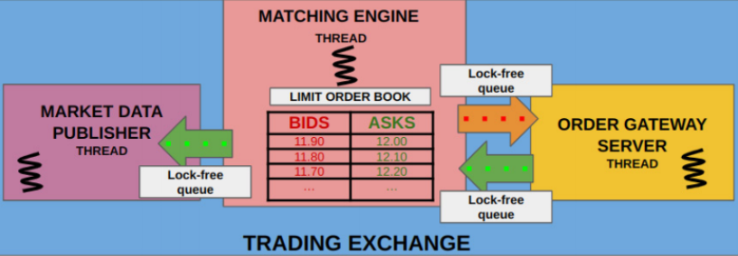
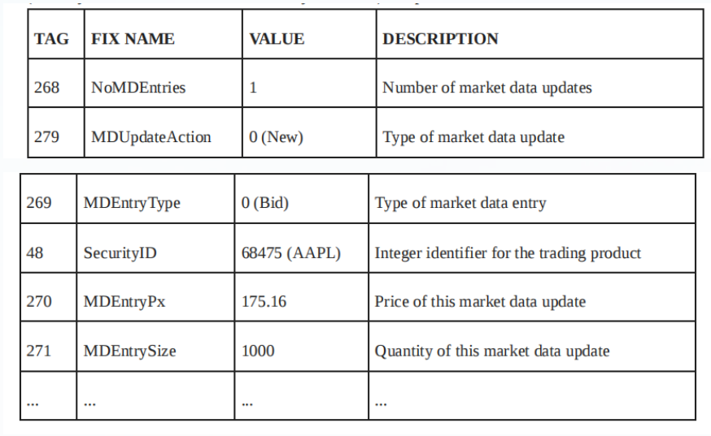
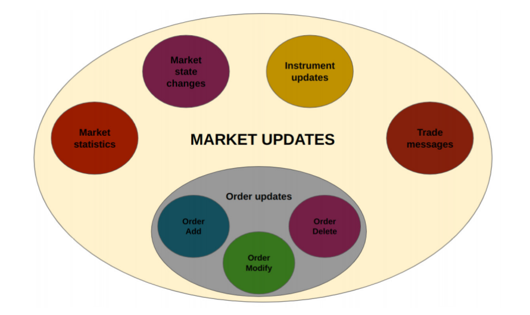
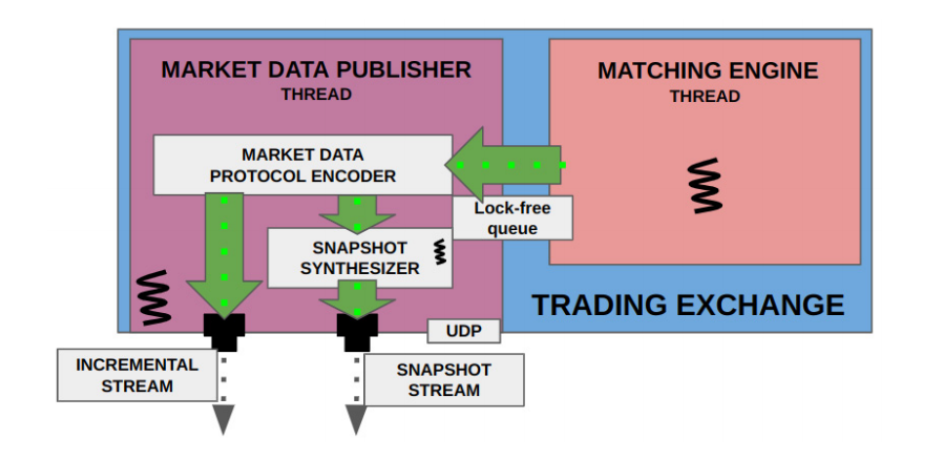
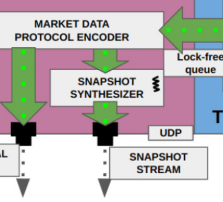

# Exchange Component Design

## Overview



As shown above, the **matching engine**, **order gateway server**, and **market data publisher** each run as independent threads. This design ensures that each component can operate autonomously, enabling the entire system to achieve maximum throughput during periods of intense market activity.

Each component also has additional responsibilities. For example, even when the matching engine is busy, the order gateway server must maintain connections with all market participants. Similarly, if the market data publisher is busy transmitting data over the network, we don't want the matching engine or order gateway server to slow down as a result.

---

## Inter-Thread Communication

A key design concern is the communication between the matching engine and the order gateway server infrastructure.

The order gateway server is responsible for **serializing** order requests from market participants and forwarding them to the matching engine for processing. Serialization here covers several dimensions:

- **Protocol Normalization** — Market participants may send orders using different protocols (FIX, custom binary, REST/WebSocket). The gateway converts all of these into a unified internal format understood by the matching engine.
- **Field Normalization** — Standardizes fields such as: price (float → fixed-point integer, e.g. 10.90 → 1090), timestamps (nanosecond-level via RDTSC), and side (Buy/Sell → enum 0/1).
- **Memory Layout Alignment** — Converts data into cache-line-aligned structs to avoid cache misses during matching engine reads.
- **Queuing / Ordering** — Orders from multiple concurrent clients are strictly queued in arrival order, forming the basis for FIFO priority.

In essence: chaotic external formats → one unified internal binary structure, allowing the matching engine to focus entirely on matching logic.

The matching engine must also generate responses to order requests and send them back to the order gateway server. Additionally, the matching engine notifies the order gateway server about trade results so participants can be informed. This requires **bidirectional queues** — one from the order gateway server to the matching engine, and one from the matching engine back to the order gateway server.

A second communication channel carries market data updates generated by the matching engine to the **public market data publisher** component, reflecting the latest state of the limit order book.

Since the matching engine, order gateway server, and market data publisher each run in separate threads, this is an ideal use case for **lock-free queues**. We use the lock-free FIFO queue implemented in the previous chapter.

---

## Limit Order Book

The limit order book uses several data structures to ensure efficient operation:

- Maintain correct order on both the **bid** and **ask** sides for efficient matching when aggressive orders arrive.
- Support efficient insertion and removal at each price level for order add, modify, and cancel operations.
- Avoid dynamic memory allocation in both the data structures and order objects. The memory pool from the previous chapter is used extensively for this purpose.

---

## Communicating Market Activity via Market Data

The market data publisher converts updates from the limit order book maintained by the matching engine. The network protocol can be TCP or UDP, but **UDP** is preferred in practice and is used here.

The **FIX Adapted for STreaming (FAST)** protocol is the most well-known market data message format used by many electronic trading platforms. Other protocols include ITCH, PITCH, EOBI, and SBE. This book uses a simple custom binary protocol similar to EOBI/SBE for demonstration.

### FIX Protocol Overview

FIX data consists of TAG=VALUE fields. For example, a new buy order for AAPL (security ID 68475), quantity 1,000, price 175.16:



---

## Market Data Message Types



### Market State Changes
Notify participants of changes to the market or matching engine state. Common states include: **Closed** (trading halted), **Pre-Open** (before regular trading), **Opening** (transitioning from Pre-Open to Trading), and **Trading** (regular session).

### Instrument Updates
Used by the exchange to inform participants about tradeable instruments. Carries metadata such as **minimum price increment** (the smallest allowed price difference between orders) and **tick size value** (the P&L impact when prices differ by one minimum increment).

For stocks and ETFs, the tick size multiplier is typically 1. For leveraged products like futures and options, the formula is:

```
P&L = ((Sell Price – Buy Price) / Min Price Increment) × Quantity × Tick Size Value
```

### Order Updates
Notifies participants of changes in the limit order book:

- **Order Add** — A new passive order has been added. Key fields: `instrument-id`, `order-id`, `price`, `side`, `quantity`, `priority`.
- **Order Modify** — A passive order's price or quantity has changed. In most cases (except quantity reductions), this triggers a new priority assignment.
- **Order Delete** — A passive order has been removed. Key fields: `instrument-id`, `order-id`.

### Trade Messages
Notifies participants of a matched trade. Typical fields: `instrument-id`, aggressive order side, trade price, trade quantity. Trade messages are often accompanied by Order Delete, Order Modify, and Order Add messages to reflect the resulting order book state.

### Market Statistics
Optional messages from some exchanges carrying statistics such as volume, open interest, high/low/open/close prices.

---

## Designing the Market Data Publisher



The market data publisher infrastructure consists of two main components that both use the socket utilities built in the previous chapter to send data over the network.

### Market Data Protocol Encoder

The encoder receives raw events from the matching engine (new orders, trades, cancellations), encodes them into a standard market data format, and publishes them to the **Incremental Stream** via UDP multicast.

This is the primary, low-latency path — every change is transmitted immediately.

### Snapshot Synthesizer

The snapshot synthesizer receives the encoder's output, maintains a complete snapshot of the current order book state, and periodically publishes this snapshot to the **Snapshot Stream** via UDP multicast.

| | Incremental Stream | Snapshot Stream |
|---|---|---|
| **Content** | Each change (delta) | Full order book state |
| **Frequency** | Real-time, every change | Periodic (low frequency) |
| **Purpose** | Keep order book current | Initialize / recover after packet loss |
| **Prerequisite** | Must already have an accurate baseline | None — directly usable |

**Correct client usage pattern:**
1. Subscribe to the **Snapshot Stream** to obtain a complete order book.
2. Subscribe to the **Incremental Stream** and apply each delta to the snapshot in real time.
3. If UDP packet loss causes a gap in the incremental sequence (detected by sequence numbers), re-fetch the snapshot and re-synchronize.

### Why UDP?

Market data streams have very high volume and highly variable activity levels, especially during volatile periods. UDP is preferred because:
- No bandwidth overhead from acknowledgment and retransmission (as with TCP).
- UDP multicast allows data to be published once while all interested subscribers receive it, avoiding one-to-one TCP connections with every consumer.

The main trade-off is that consumers may drop UDP packets due to network congestion or slow processing. The snapshot stream exists specifically to address this.

---

## Snapshot Synthesizer (Detail)



The snapshot synthesizer runs as an independent execution thread, responsible solely for generating accurate order book snapshots from incremental updates.

Key points:
- Snapshot generation does **not** interfere with the incremental stream, ensuring incremental updates are published as fast as possible.
- Before publishing snapshots via UDP multicast, the component attaches correct sequence information to enable client synchronization.
- Specifically, snapshot messages include the **last sequence number from the incremental stream** used to build the snapshot. Downstream clients use this to complete synchronization or catch up on missed data.
- Low-latency standards that apply elsewhere in the system **do not apply here** — this is an inherently delayed, downsampled stream. Client packet loss is rare, and snapshot re-sync is a slow process, so aggressive low-latency optimization is unnecessary.

---

## Order Gateway vs. Market Data: Key Differences

### Network Protocol
- **Market Data Publisher** → UDP (high volume, needs speed; snapshot stream handles packet loss recovery)
- **Order Gateway Server** → TCP (requires reliable delivery; missed confirmations or trade notifications would be unacceptable for participants)

### Public vs. Private Information

| | Market Data Publisher | Order Gateway Server |
|---|---|---|
| **Data Type** | Public | Private (per-client) |
| **Audience** | All market participants | Only the client with the relevant order |
| **Content** | Order book state (anonymized) | Order status, trade fills for that client |
| **Direction** | Exchange → subscriber (one-way) | Bidirectional (client sends requests, exchange sends responses) |

A participant does **not** need to have any orders in the book to receive public market data. However, to receive private order gateway notifications, the participant must have active orders.

---

## Designing the Order Gateway Server


### TCP Connection Manager

The first component in the order gateway infrastructure. Responsibilities:
- Establishes a TCP server to listen for and accept connections from participant order gateway clients.
- Detects disconnected clients and removes them from the active connection list.
- Forwards order responses from the matching engine to the appropriate client.

Uses the socket utilities, TCP socket, and TCP server functionality built in the previous chapter.

### FIFO Sequencer

Ensures **fairness** in processing participant requests. Participant requests must be processed in strict arrival order. The FIFO sequencer ensures that across all client connections maintained by the TCP connection manager, requests are forwarded to the matching engine in the exact order they arrived.

### Exchange Message Protocol Codec

Handles conversion between the exchange message protocol and the internal data structures required by the matching engine (for receiving client requests and publishing client responses).

Depending on protocol complexity, this may involve:
- Simple packing/unpacking of compact binary structures.
- Additional encoding/decoding steps for more complex exchange message formats.

This book uses a simple exchange order message protocol based on compact binary structures, with additional fields beyond the base format used by the matching engine.