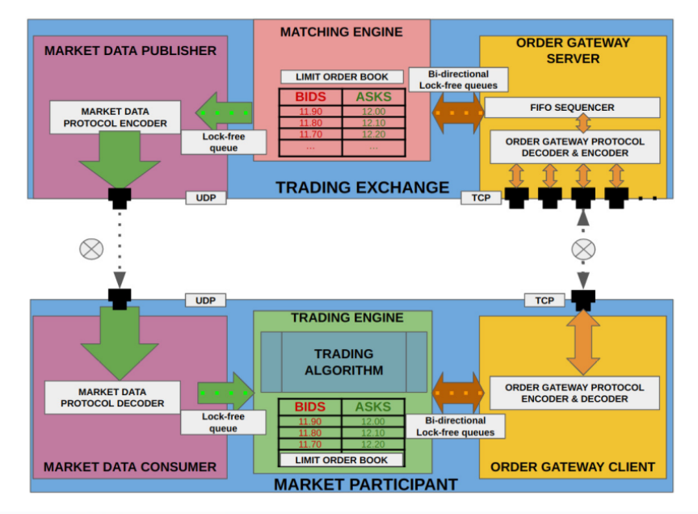
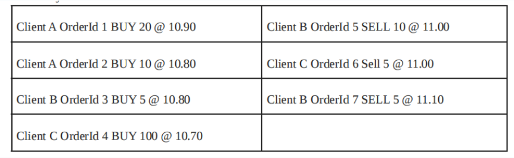
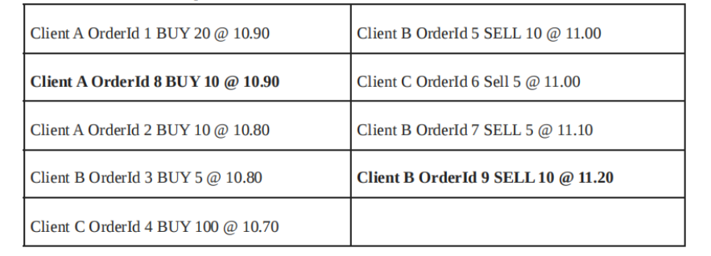
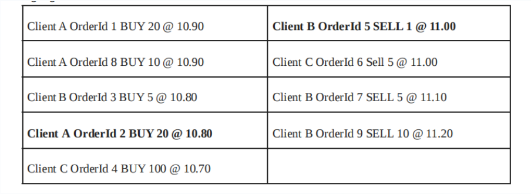
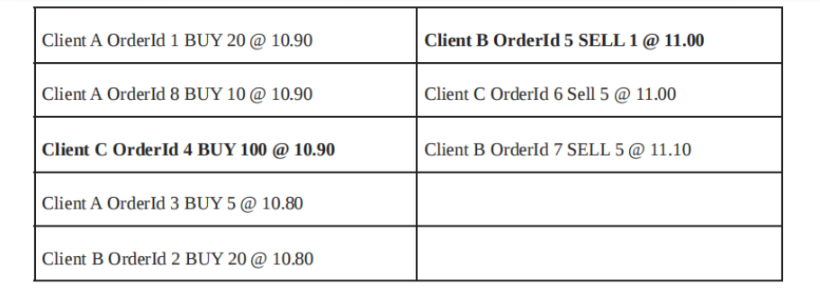
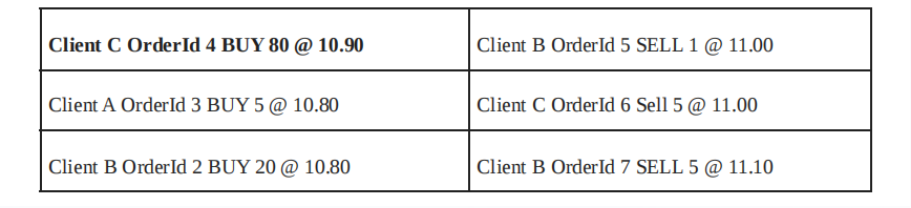
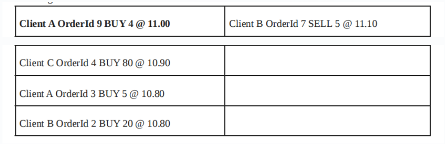

# Order Book & Trading Ecosystem Design

> A distilled reference of Chapter 5 concepts: matching engine, order gateway, market data publisher, and limit order book mechanics.

---

## Trading Ecosystem Overview

The electronic trading ecosystem consists of two sides:

**Exchange side**
- Matching Engine
- Order Gateway Server & protocol codecs
- Market Data Encoder & Publisher

**Market Participant (client) side**
- Market Data Consumer & Decoder
- Order Gateway Codec Client
- Trading Engine

---

## Market Data Publisher

The Market Data Publisher broadcasts every change to the limit order book (maintained by the matching engine) to all market participants.

**Key characteristics:**
- Publishes **public, anonymized** data — order ownership is hidden to protect participant strategies
- Aggregates orders at each price level (e.g., 1500 shares at 11.90, not who owns what)
- Uses **UDP multicast** as the preferred transport due to high update volume
- Converts matching engine internal format → external market data protocol (FIX, ITCH/OUCH, custom binary)
- Pushes **incremental updates (diffs)**, not full snapshots each time

**Internal format vs market data format:**

| Internal (C++ struct) | External (Market Data Protocol) |
|---|---|
| Compact, cache-aligned, fixed-width integers | FIX (tagged text), ITCH/OUCH (binary), custom binary |
| `uint64_t price` (fixed-point, no floats) | Human/machine readable, network-serializable |

**Analogy:** Market Data Publisher = exchange's public bulletin board. It says "11.90 bid, 1500 total" but never reveals which participant placed which order.

**Comparison with Order Gateway:**

| | Market Data Publisher | Order Gateway |
|---|---|---|
| Audience | Everyone | Only you |
| Content | Public market summary | Your order status |
| Protocol | UDP multicast | TCP point-to-point |
| Analogy | TV news broadcast | Bank SMS notification |

---

## Matching Engine

The matching engine is the core of the entire trading system. It:

- Accepts order requests (new / modify / cancel) from market participants via the Order Gateway
- Maintains the limit order book
- Matches orders when buy price ≥ sell price (aggressive order crosses the spread)
- Ensures **FIFO fairness**: orders that arrive first get priority at the same price level

**Order types in the book:**

| Type | Description |
|---|---|
| **Passive order** | Resting in the book, waiting for a match |
| **Aggressive order** | New order whose price crosses existing passive orders |

Matching priority: highest bid first; lowest ask first. For same price, FIFO order.

> Our implementation uses **FIFO-only** matching. (Other algorithms: Pro Rata, hybrid FIFO+Pro Rata.)

---

## Order Gateway Server (Exchange Side)

- Accepts TCP connections from market participants
- Serializes incoming order requests into the matching engine's internal format
- Converts matching engine responses back to the order gateway message protocol
- Notifies **only the affected participant** of their order status updates (not broadcast)
- Uses TCP for reliable, ordered delivery

---

## Market Data Consumer (Participant Side)

- Subscribes to the exchange's UDP multicast stream
- Receives incremental market data updates
- Decodes market data protocol → internal format used by the trading engine
- Maintains a **local copy of the limit order book**

---

## Order Gateway Codec Client (Participant Side)

- Establishes and maintains a TCP connection to the exchange's Order Gateway
- Encodes strategy-generated order requests into the exchange's order message protocol
- Decodes exchange responses back into the trading engine's internal format

---

## Trading Engine (Participant Side)

The "brain" of the market participant system. It:

- Receives normalized market data from the Market Data Consumer
- Builds and maintains a local limit order book (full or simplified)
- Analyzes liquidity and price levels
- Makes automated trading decisions
- Communicates with the exchange via the Order Gateway Codec Client

---

## Limit Order Book Mechanics

### Structure

Orders are sorted:
- **Bids**: highest price first (most aggressive buyer at the top)
- **Asks**: lowest price first (most aggressive seller at the top)
- **Same price, same side**: FIFO (earliest order first)

### Example Setup

Three participants: Client A, Client B, Client C.

**Initial passive orders:**

| Participant | Side | Qty | Price |
|---|---|---|---|
| Client A | BUY | 20 | 10.90 |
| Client A | BUY | 10 | 10.80 |
| Client B | BUY | 5 | 10.80 |
| Client B | SELL | 10 | 11.00 |
| Client B | SELL | 5 | 11.10 |
| Client C | BUY | 100 | 10.70 |
| Client C | SELL | 5 | 11.00 |

### Adding New Orders

Client A adds: BUY 10 @ 10.90 (OrderId 8)
Client B adds: SELL 10 @ 11.20 (OrderId 9)

FIFO at 10.90 BID: OrderId 1 (arrived first) → OrderId 8 (arrived second).
11.20 ASK is the worst ask price, goes to the bottom of the ask side.

### Modifying Orders

**Rule 1 – Increase quantity or change price → loses FIFO priority (goes to back of queue)**

**Rule 2 – Decrease quantity → keeps FIFO priority**

Example:
- Client A increases OrderId 2 (BUY @ 10.80) from qty 10 → 20: **moves to back of 10.80 queue**
- Client B decreases OrderId 5 (SELL @ 11.00) from qty 10 → 1: **stays at front**

Correct state at 10.80 BID after modification:

| Position | Order |
|---|---|
| 1st | Client B OrderId 3 BUY 5 @ 10.80 |
| 2nd | Client A OrderId 2 BUY 20 @ 10.80 |

> ⚠️ Note: the book contains a typo in Table 5.3 — "Client A OrderId 3" should read "Client B OrderId 3".

### Price Modification & Cancellation

- Client C changes OrderId 4 price from 10.70 → 10.90: **moves to back of 10.90 BID queue**
- Client B cancels OrderId 9 (SELL @ 11.20): **OrderId 9 is permanently gone, never reused**

---

## Order Matching (Aggressive Orders)

Matching rules:

- Passive bids matched highest price first
- Passive asks matched lowest price first
- **Full match**: order removed from book
- **Partial match (aggressive > passive liquidity)**: passive order removed, remaining aggressive qty becomes a new passive order
- **Partial match (aggressive < passive liquidity)**: passive order quantity reduced, aggressive order fully consumed

### Example 1 – Client C sells 50 @ 10.90

Matches against OrderId 1 (20 qty, full fill) and OrderId 8 (10 qty, full fill).
OrderId 4 partially filled: 20 of 80 remaining sold → 60 qty left.

### Example 2 – Client A buys 10 @ 11.00

Matches OrderId 5 (1 qty, full fill) and OrderId 6 (5 qty, full fill).
Remaining 4 qty unmatched → becomes passive BUY order resting in the book.

---

## Order Modification Rules Summary

| Action | FIFO Priority |
|---|---|
| Decrease quantity | ✅ Unchanged |
| Increase quantity | ❌ Reset (goes to back of queue) |
| Change price | ❌ Reset (treated as cancel + new order) |

---

## Key Takeaways for Development

- **Prices stored as fixed-point integers** (e.g., 10.90 → 1090) — never floats inside the engine
- **OrderIds are monotonically increasing** and never reused after cancellation
- **tick size** (minimum price increment) is used to validate incoming orders and store prices efficiently
- **tick value** (P&L per tick) matters for settlement modules, less so for the matching engine itself
- FIFO ordering is enforced by the Order Gateway serialization layer, not the matching engine itself
