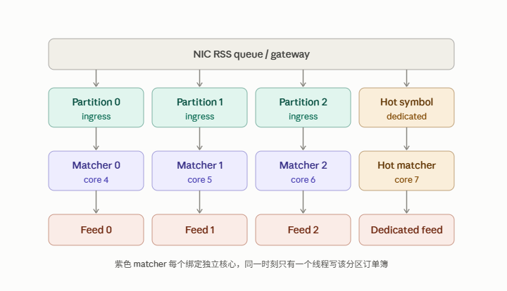

# Single-Writer Matching Partitions: Why the Matching Engine Doesn't Become a Thread Pool

## TL;DR

For this project's matching module, the claim isn't "a single thread can handle all real market volume." The claim is narrower and more defensible: **a single thread is the correct concurrency model for one matching partition**. Production-grade throughput comes from running many independent partitions in parallel, not from letting multiple workers write the same order book.

---

## The 90-Second Answer

I separate *single-threaded matching state machine* from *single-threaded system*.

An order book's core invariants — price priority, time priority, determinism — depend on one thing: every new order, cancel, fill, and market-data event must mutate state in the same, well-defined sequence. For a given symbol (or matching partition), I want exactly one thread to be the state owner. It consumes events in order, updates the book, and emits fills and market data. That avoids lock contention, context-switch overhead, cache-line bouncing, and the ordering/fairness problems that show up the moment more than one thread can touch the same book.

But no production system hands one thread the entire market. The correct scaling axis is to partition by symbol or product group, bind each partition to a dedicated CPU core, and give it its own ingress queue, matching loop, and market-data publication path. Partitions run genuinely in parallel across cores; ordering is only guaranteed *within* a partition. Nasdaq has publicly described expanding its matching configuration to four partitions — order reference numbers stay strictly increasing per symbol, but numbers across different symbols can interleave. That's the tell: the system never needed one global sequence, only a per-symbol one.

I keep thread pools out of the hot path entirely. A thread pool is a good fit for asynchronous, parallelizable, order-independent work — but it introduces scheduling, work stealing, wake-up latency, and cache migration, all of which blow up tail latency. The hot path should be a fixed-responsibility event loop or a dedicated thread plus a bounded SPSC/MPSC queue, busy-polling where needed, with CPU affinity, NUMA locality, and NIC RSS-queue alignment. Thread pools belong on the slow path: logging, monitoring, historical persistence, reporting, snapshot compression.

If one symbol runs unusually hot, the fix is not to split its single order book across multiple writer threads — that breaks price-time priority. The right move is to give that symbol its own dedicated matching unit and push single-core capability further: preallocated memory, cache-friendly layout, tighter capacity control, hot standby. Cboe's public notices about standing up a dedicated Matching Unit to increase throughput and capacity for QQQ and SPY are a real-world example of exactly this pattern — isolate the hot symbol into its own capacity unit rather than cutting up its book.

So the next step for this project isn't "put `MatchingEngine` in a thread pool." It's evolving from one global single-threaded matcher into multiple single-threaded matcher shards keyed by ticker, each pinned to its own core — strict ordering within a shard, real parallelism across shards.

---

## Principle 1 — Why One Order Book Should Have Exactly One Writer

A production exchange isn't "the whole system runs on one thread." It's "every matching partition that needs strict ordering and consistent state uses a single-writer, single-threaded hot path — and the system as a whole scales horizontally across cores and processes by symbol, product group, or matching unit."

An order book isn't "a map with concurrent reads and writes." It's a state machine with business-level ordering semantics. New orders, cancels, fills, and market-data events all have to mutate state in one determinate sequence, or you lose price priority, same-price FIFO, replayability, auditability, and explainable fills.

Letting multiple threads write the same book costs you one of two ways:

- **Locked coordination** (mutex, RW lock, atomics) — contention at hot price levels and during bursts, which blows up p99/p99.9 latency.
- **Lock-free but still shared** — nominally lock-free, but you still have to solve ordering merge, memory visibility, cancel/fill races, and deterministic replay. The complexity is enormous for what you get.

The better design is the **single writer principle**: one matching state machine on one core owns all mutable state for a partition. Outside threads can only push events into that state machine's input queue — never touch the book directly.

LMAX's published architecture is the textbook example: a single-threaded, in-memory Business Logic Processor reportedly handling 6 million orders/second, wrapped by a lock-free Disruptor queue. The important nuance is that LMAX never claimed "one thread solves the entire production problem" — external I/O is pushed out as asynchronous events, and fault recovery is handled through replicas, journaling, and snapshots, not through more writer threads.

## Principle 2 — The System Is Parallel Overall, Scaled by Partition, Not by Task Pool

Public material from real exchanges is consistent on this point: they scale matching capacity by **partition** or **matching unit**, not by converging every symbol onto one global matching lock.

| Public production practice | Architectural takeaway | How to phrase it in an interview |
|---|---|---|
| Nasdaq expanded matching to 4 partitions; order reference numbers stay strictly increasing per symbol, but interleave across symbols. | The ordering boundary is symbol/partition, not the whole market. | "Sharding by symbol doesn't break per-symbol fairness." |
| Cboe C2 stood up dedicated Matching Units to raise throughput/capacity for QQQ and SPY. | Especially hot symbols can be governed as their own capacity unit. | "A hot symbol shouldn't be split across writers — it should get its own matching unit." |
| Deutsche Börse T7's public material deploys partition-specific gateways alongside matching engines, with each partition spread across two data centers. | Partitioning is both a throughput boundary and an isolation/availability boundary. | "Horizontal sharding isn't only for performance — it's also for fault isolation and failover." |
| LMAX's public design combines single-threaded business logic with lock-free queues, an event journal, snapshots, and active/standby replicas. | A single-threaded hot path isn't the same thing as a single point of failure or no recovery path. | "Real-time single-writer state machines get their reliability from replication and replay, not from adding writer threads." |

**On phrasing:** avoid saying "every exchange's matching engine is single-threaded" — nobody outside those companies actually knows their internal threading model, and it varies by asset class, options strategies, auctions, and cross-product risk controls. The defensible version is:

> "Real systems typically converge strictly-ordered state into single-writer partitions, then scale those partitions horizontally. Nasdaq, Cboe, and T7 all publicly use a partition or matching-unit layer; exactly how many threads sit inside one partition is each exchange's own implementation detail."

## Principle 3 — Not Using a Thread Pool Doesn't Mean No Threads

The instinct to avoid thread pools on the hot path is correct — but it should be phrased precisely: it's not an objection to threads, it's an objection to handing an ordered, low-jitter state machine to a *dynamically scheduled* pool.

| Scenario | Recommended model | Why |
|---|---|---|
| Matching for one symbol/partition | One fixed, core-pinned matcher thread | Preserves ordering, avoids locks, keeps cache locality |
| Market-data ingestion, decode, sequence checking | Fixed feed-handler/event-loop thread, assigned by feed/partition | Aligns with NIC queue / RSS / CPU core, minimizes cross-core data movement |
| Client-side local order book & strategy hot path | One fixed trading thread per strategy partition or symbol group | The local book should also have exactly one writer |
| Order gateway | Dedicated connection/event-loop thread, or a fixed gateway thread per partition | Owns the socket and sequence numbers, doesn't perform matching |
| Logging, metrics aggregation, historical persistence, reporting, offline risk analysis | Thread pool, batch processing, or async work queue | Fine to accept scheduling and batching — it shouldn't be on the critical path |
| Snapshot serialization / compression | Async thread, driven off a consistent snapshot point | Keeps interference away from the matcher |

A thread pool's real problem isn't "it's always slow" — it's that its *behavior is less predictable*: task queuing, worker wake-up, work stealing, load imbalance, cross-core migration, and shared-queue contention all add tail latency. For a nanosecond/microsecond-scale, strictly-ordered pipeline like matching, predictability usually matters more than average throughput.

---

## When Real Volume Actually Spikes

### 1. Route by deterministic key, don't discover workers on the hot path

Once an order enters the system, route it by a static `symbol → partitionId → matcher core` mapping. Market-data updates route by the same partition key. That guarantees every event for a given symbol always lands on the same owner thread. Never hand a message to a shared pool and let any worker pick it up.

*Multi-core parallelism here comes from several independent, single-threaded pipelines running side by side — no order book is ever written by more than one core at the same time.*

### 2. A hot symbol gets its own partition — a continuous book shouldn't be cut up

If a single symbol (a heavily-traded index ETF, a very active option) becomes the bottleneck, migrate it out of the shared shard first, into its own dedicated matching unit. Then push single-core capability further on that unit: preallocated memory, cache-friendly contiguous data structures, shorter call paths, fewer branches, batched packet receipt with strictly sequential processing, pinned CPU frequency, isolated core, NIC receive queues aligned to the CPU's NUMA node.

What you cannot do is hand the bid side of one continuous order book to thread A and the ask side to thread B, or let multiple workers "steal" work from a shared queue — cross-side fills, cancels, and price-time priority immediately require coordination the moment you do that. Barring a purpose-built parallel matching model, owning one core is simpler and far easier to verify for a standard limit order book.

### 3. Overload gets backpressure and capacity governance, not unbounded queueing

If a partition's queue depth, processing latency, or NIC drop counters cross a threshold, the production answer is monitoring plus governance: bounded queues, ingress throttling/risk limits, a partition-migration plan, isolating hot symbols, market-data gap detection, and snapshot/replay recovery. The wrong answer is "let the queue grow and let the thread pool eventually catch up" — that just converts insufficient throughput into unacceptable latency.

On the market-data side, UDP multicast can drop packets. Clients should detect gaps by sequence number and recover consistent state via snapshot or retransmission — this project's existing "incremental stream + snapshot stream + buffered increments" recovery path is the right shape and should be kept and strengthened, not papered over with more threads.

### 4. High availability comes from journaling, replication, and failover — not from locking the book

A single-threaded matcher partition can still be highly available: record order input as a replayable journal, have a hot-standby instance consume the same ordered input, keep the primary serving traffic while the standby stays in sync, fail over on fault, and use snapshots to shorten recovery time. LMAX's public design — sequential in-memory state machine plus journal, snapshot, and multiple replicas — is exactly this pattern.

---

## Mapping This Back to the Project

Today, `MatchingEngine` maintains every ticker's `MEOrderBook` inside one thread. The order service sequences requests through `FIFOSequencer` and hands them to a single matching request queue. That single-threaded structure is a good fit for demonstrating order book correctness, but it caps every ticker's throughput on one core.

The production-grade evolution is **partitioned single-writer matching**, not a thread pool:

| Current design | Production evolution |
|---|---|
| One `MatchingEngine` thread handles every ticker. | Multiple `MatchingShard`s; each shard owns a statically-assigned set of tickers, with its own input/output queues and a dedicated core. |
| One global request queue. | The gateway routes by `ticker_id` to a partition-specific request queue; ordering for a given ticker is only serialized within its shard. |
| One `MarketDataPublisher` aggregates and publishes. | Each shard emits an internally-consistent incremental stream; publication can be per-partition or merged by a fixed publisher thread, but the merge step must never feed back into the matcher. |
| A single consumer/trading engine on the client side handles every ticker. | Fixed feed handlers, partitioned by market data, fan out to single-writer local order book/strategy shards; cross-symbol strategies get an explicit coordination boundary. |
| `createAndStartThread(-1, ...)` doesn't pin cores by default. | Deployment config explicitly pins `matcher`, `gateway`, `feed handler`, and `strategy` threads to isolated cores, aligned to NUMA/NIC queues. |
| The queue exposes a demonstrative lock-free interface. | Production uses a verified bounded SPSC/MPMC queue with defined full-queue behavior, memory ordering, backpressure, and observability. |

**One-line description of the redesign:**

> "I keep the single-threaded matcher's determinism, but use `ticker_id` as the partition key to split one global matcher into N matcher shards with no shared mutable order-book state. N shards are pinned to N cores and run in parallel. Correctness of ordering becomes local and provable; throughput becomes horizontally scalable."

---

## Likely Follow-Up Questions

**How does a single thread support high throughput?**
Because each match is fundamentally a short, in-memory state transition — it shouldn't involve a database call, an RPC, disk sync, or lock waits. With cache-friendly data structures, preallocated objects, and strictly sequential event processing, a single core's throughput can be very high. LMAX's public figure is 6 million orders/second on one thread; I wouldn't apply that number directly to this project, but it disproves the premise that "single-threaded necessarily can't keep up." What actually needs to be measured is this machine's hardware, order-flow shape, book depth, market-data fan-out, and p99 latency under load.

**Is CPU affinity a silver bullet?**
No. Pinning a thread reduces migration, scheduling, and cache jitter — but you also need core isolation, NUMA-local memory, NIC RSS-queue-to-core mapping, avoiding co-tenant interference on the same core, preallocated memory, and verification via p50/p99/p99.9. Core pinning is deterministic infrastructure, not a performance silver bullet.

**Why not update the same order book from multiple threads?**
Because a single book's FIFO ordering, cancels, fills, and market-data publication all share one deterministic sequence. Adding threads isn't free parallelism — it introduces locks, CAS retries, cache-line jitter, complex linearization points, and hard-to-reproduce fairness bugs, right at the most latency-sensitive part of the system. The right parallelism boundary is symbol/partition, not inside one book.

**What about cross-symbol strategies?**
Matching order is still preserved per-symbol owner thread. A strategy can consume read-only latest state published from multiple partitions and emit multiple order intents, each routed back to its own matcher. If a strategy needs strictly atomic execution across symbols, that's not two independent order-book problems in disguise — it requires accepting coordination/latency cost, or designing an explicit same-partition, combined-product, or dedicated atomic-execution mechanism.

**What happens when market data suddenly spikes and queues back up?**
First separate a short burst from sustained overcapacity. Absorb short bursts with a small, bounded ring buffer while recording queue depth and queueing latency. Sustained overcapacity needs more partitions, isolating hot symbols, higher per-partition single-core efficiency, or ingress throttling. For UDP market data, a sequence gap should never be silently skipped over — detect it and recover via snapshot/replay.

---

## Phrasing to Avoid — and the Better Version

| Imprecise phrasing | More defensible, production-engineer phrasing |
|---|---|
| "Industry standard is single-threaded." | "Strictly-ordered matching state typically converges on single writers; the overall system scales horizontally via partitioning, multi-core, and multi-process." |
| "Thread pools are never acceptable." | "Thread pools shouldn't sit on the deterministic-matching/order-book-write hot path; they're fine on slow paths and non-time-critical tasks." |
| "Pinning one CPU core solves throughput." | "Core pinning is one piece of reducing jitter — you still need partitioning, queueing, NUMA, NIC RSS, memory layout, and capacity testing." |
| "One matcher handles the whole market." | "One matcher handles one partition; the system handles the whole market through many independent partitions." |
| "Multithreading is always faster." | "With shared mutable state and strict ordering requirements, multithreading can raise average throughput while making tail latency and correctness worse." |

---

## References

1. Nasdaq — public notice on expanding matching configuration to multiple partitions.
2. Cboe C2 Options Exchange — public notice on Matching Engine capacity enhancements.
3. LMAX Exchange — "The LMAX Architecture" (publicly documented design).
4. Deutsche Börse T7 — public documentation on partition-specific Gateway and Matching Engine deployment.
5. This repository's market-data consumer and recovery implementation notes.
